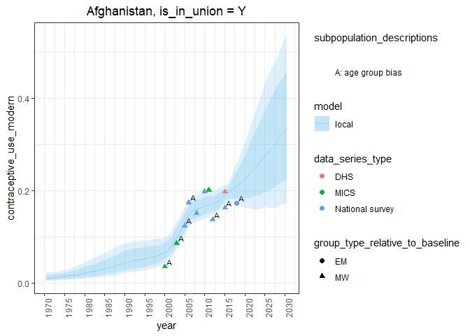
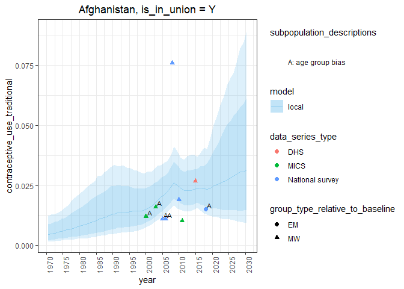
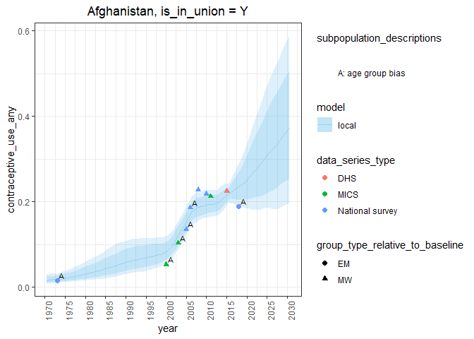
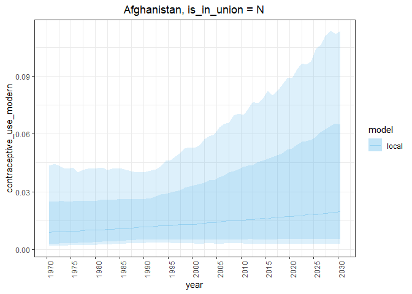
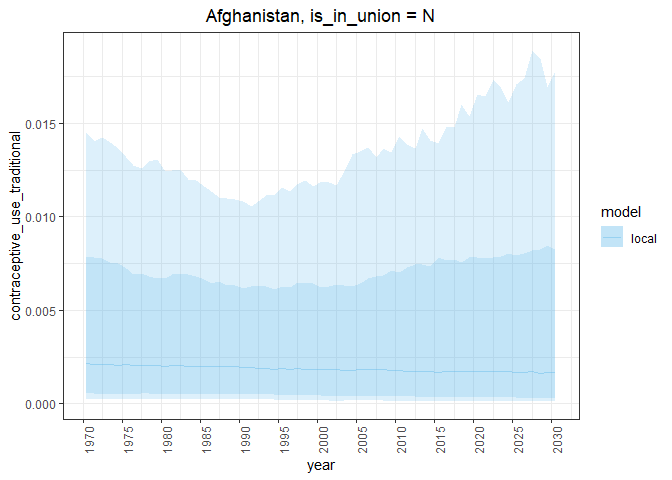
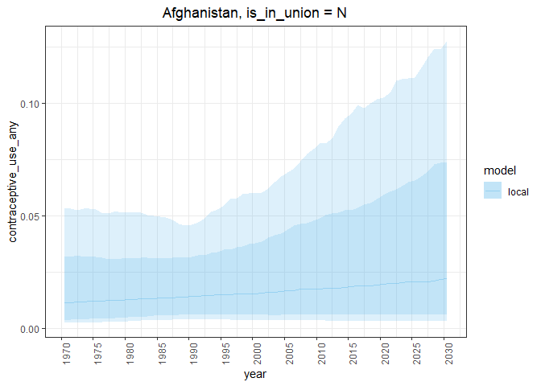
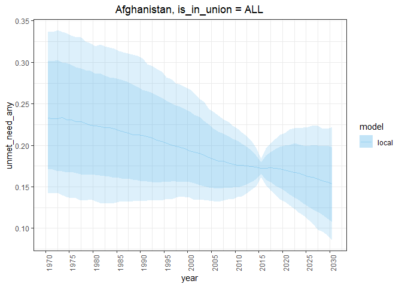
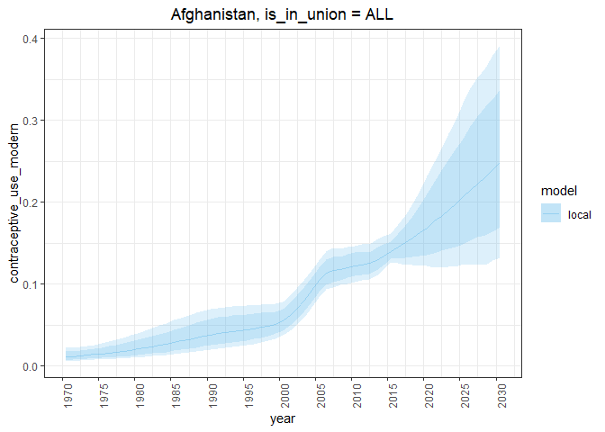
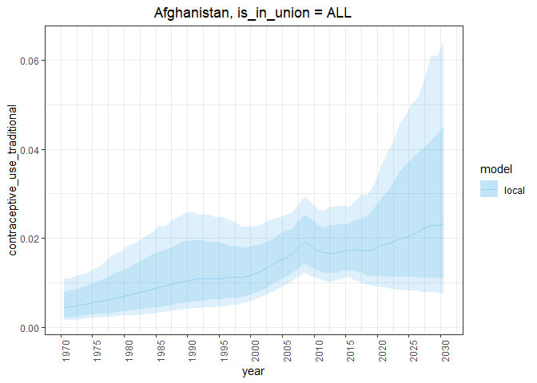

Estimating family planning indicators for all women
================

## Introduction

In this vignette we obtain estimates for all women with package
datasets. By default, functions utilize UNPD datasets.

``` r
library(fpemlocal)
```

1.  [Fit models and obtain samples for all women](#fit) `fit_fp_c`
2.  [Calculate point estimates for indicators](#results)
    `fpet_calculate_indicaotrs`
3.  [Plot the point estimates against the survey data](#plot)
    `plot_fp_c`

## <a name="fit"></a>

## 1\. Fit models and obtain samples for all women

`fit_fp_c` is a wrapper function to run the one-country implementation
of the family planning estimation model. Specify the division numeric
code, the union status of women (denote all women with `“ALL”`), and the
time frame.

``` r
fitlist <- fit_fp_c(
  is_in_union = "ALL",
  division_numeric_code = 4,
  first_year = 1970,
  last_year = 2030
)
```

Obtaining results for all women entails running the in-union and
not-in-union model. In this case, `fit_fp_c` returns a named list of
fits.

``` r
fitlist %>% names
```

    ## [1] "Y"   "N"   "ALL"

## <a name="results"></a>

## 2\. Calculate point estimates for indicators

Calculate point estimates for family planning indicators with the
function `calc_fp_c`.

`calc_fp_c` utilizes `pmap` from the tidyverse package purr allowing it
to act on any number of fits. We will supply the entire list of fits
from `fit_fp_c`.

``` r
resultlist <- calc_fp_c(fitlist)
```

Like the previous function, `calc_fp_c` returns a list. Since we
supplied three fits the function returns three sets of calculated family
planning indicators.

``` r
resultlist %>% names
```

    ## [1] "Y"   "N"   "ALL"

A set of results here consist of the following family planning
indicators

``` r
resultlist$ALL %>% names
```

    ##  [1] "contraceptive_use_any"                     
    ##  [2] "contraceptive_use_modern"                  
    ##  [3] "contraceptive_use_traditional"             
    ##  [4] "non_use"                                   
    ##  [5] "unmet_need_any"                            
    ##  [6] "unmet_need_modern"                         
    ##  [7] "demand"                                    
    ##  [8] "demand_modern"                             
    ##  [9] "demand_satisfied"                          
    ## [10] "demand_satisfied_modern"                   
    ## [11] "no_need"                                   
    ## [12] "contraceptive_use_any_population_counts"   
    ## [13] "contraceptive_use_modern_population_counts"
    ## [14] "traditional_cpr_population_counts"         
    ## [15] "non_use_population_counts"                 
    ## [16] "unmet_need_population_counts"              
    ## [17] "unmet_need_modern_population_counts"       
    ## [18] "demand_modern_population_counts"           
    ## [19] "demand_population_counts"                  
    ## [20] "demand_satisfied_population_counts"        
    ## [21] "demand_satisfied_modern_population_counts" 
    ## [22] "no_need_population_counts"

The point estimates for each indicator are long-format tibbles. Let’s
take a look at the tibble for the indicator `contraceptive_use_modern`

``` r
resultlist$ALL$contraceptive_use_modern
```

    ## # A tibble: 488 x 3
    ##     year percentile  value
    ##    <int> <chr>       <dbl>
    ##  1  1970 mean       0.0116
    ##  2  1971 mean       0.0123
    ##  3  1972 mean       0.0130
    ##  4  1973 mean       0.0138
    ##  5  1974 mean       0.0147
    ##  6  1975 mean       0.0156
    ##  7  1976 mean       0.0167
    ##  8  1977 mean       0.0179
    ##  9  1978 mean       0.0191
    ## 10  1979 mean       0.0205
    ## # ... with 478 more rows

## <a name="plot"></a>

## 3\. Plot the point estimates and the survey data

fpemlocal also includes a function named `plot_fp_c` to plot the
calculated point estimates against the survey data. The arguments to
this function are, the fit object from step 1, the results from step 2,
and a vector of indicator names. The vector of indicator names
corresponds to the names which appear in the results from step 2. This
function also handles lists.

``` r
plot_fp_c(
  fitlist,
  resultlist,
  indicators = c(
    "unmet_need_any",
    "contraceptive_use_modern",
    "contraceptive_use_traditional",
    "contraceptive_use_any"
    )
  )
```

    ## $Y
    ## $Y$unmet_need_any

<!-- -->

    ## 
    ## $Y$contraceptive_use_modern

<!-- -->

    ## 
    ## $Y$contraceptive_use_traditional

<!-- -->

    ## 
    ## $Y$contraceptive_use_any

<!-- -->

    ## 
    ## 
    ## $N
    ## $N$unmet_need_any

<!-- -->

    ## 
    ## $N$contraceptive_use_modern

<!-- -->

    ## 
    ## $N$contraceptive_use_traditional

<!-- -->

    ## 
    ## $N$contraceptive_use_any

<!-- -->

    ## 
    ## 
    ## $ALL
    ## $ALL$unmet_need_any

<!-- -->

    ## 
    ## $ALL$contraceptive_use_modern

<!-- -->

    ## 
    ## $ALL$contraceptive_use_traditional

<!-- -->

    ## 
    ## $ALL$contraceptive_use_any

<!-- -->
