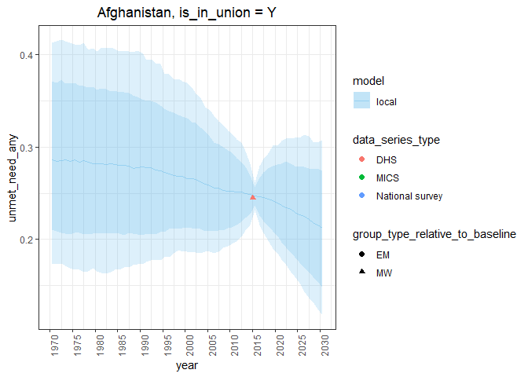
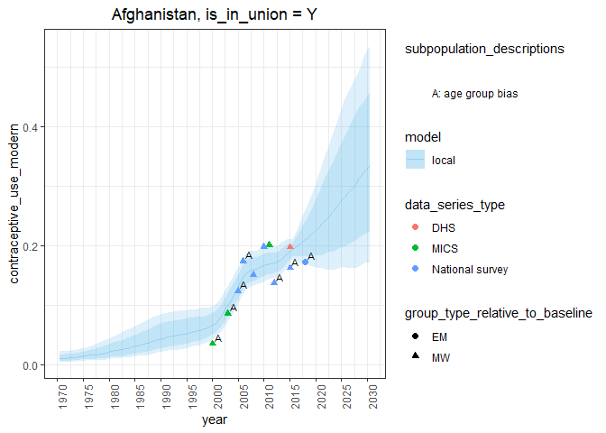

Estimating family planning indicators for in-union women
================

``` r
library(fpemlocal)
```

## Introduction

In this vignette we obtain estimates for married women with package
datasets. By default, functions utilize UNPD datasets.

1.  [Fit a one country model](#fit) `fit_fp_c`
2.  [Calculate point estimates for indicators](#results) `calc_fp_c`
3.  [Plot the point estimates against the survey data](#plot)
    `plot_fp_c`

## <a name="fit"></a>

## 1\. Fit a one country model

First, find the UNPD country code under the variable
`division_numeric_code` in the dataset `divisions`. See `?divisions` for
the metadata.

``` r
divisions %>%
  dplyr::filter(name_country == "Afghanistan")
```

    ## # A tibble: 1 x 13
    ##   division_numeri~ name_country name_region name_sub_region region_numeric_~
    ##              <dbl> <chr>        <chr>       <chr>                      <dbl>
    ## 1                4 Afghanistan  Asia        South-Central ~              935
    ## # ... with 8 more variables: sub_region_numeric_code <dbl>,
    ## #   is_developed_region <chr>, is_less_developed_region <chr>,
    ## #   is_least_developed_country <chr>, is_in_sub_saharan_africa <chr>,
    ## #   is_unmarried_sexual_activity <chr>, is_low_population <chr>,
    ## #   is_fp2020 <chr>

Fit the one-country family planning estimation model with the function
`fit_fp_c`. First, supply the UNPD country code to the argument
`division_numeric_code`. There are two versions of this model, one for
in-union women and another for not-in-union women denoted `"Y"` and
`"N"` respectively. Specify the model of your choice with the argument
`is_in_union`. By default, the function `fit_fp_c` utilizes the UNPD
contraceptive use survey dataset, `contraceptive_use` and filters the
dataset based on the aforementioned function arguments. Lastly, specify
the years of estimates to be returned. Note: year arguments will not
filter the supplied survey data. All years of available survey data will
be used.

``` r
fit <- fit_fp_c(
  division_numeric_code = 4,
  is_in_union = "Y",
  first_year = 1970,
  last_year = 2030
)
```

## <a name="results"></a>

## 2\. Calculate point estimates for indicators

Calculate point estimates for family planning indicators with the
function `calc_fp_c`. Supply the fit object from `fit_fp_c`. By default,
the function `calc_fp_C` utilizes the UNPD population dataset,
`population_counts` to calculate count variables such as the number of
women using modern contraceptives.

``` r
results <- calc_fp_c(fit)
```

A set of results here consist of the following family planning
indicators

``` r
results$Y %>% names
```

    ##  [1] "contraceptive_use_any"                     
    ##  [2] "contraceptive_use_modern"                  
    ##  [3] "contraceptive_use_traditional"             
    ##  [4] "non_use"                                   
    ##  [5] "unmet_need_any"                            
    ##  [6] "unmet_need_modern"                         
    ##  [7] "demand"                                    
    ##  [8] "demand_modern"                             
    ##  [9] "demand_satisfied"                          
    ## [10] "demand_satisfied_modern"                   
    ## [11] "no_need"                                   
    ## [12] "contraceptive_use_any_population_counts"   
    ## [13] "contraceptive_use_modern_population_counts"
    ## [14] "traditional_cpr_population_counts"         
    ## [15] "non_use_population_counts"                 
    ## [16] "unmet_need_population_counts"              
    ## [17] "unmet_need_modern_population_counts"       
    ## [18] "demand_modern_population_counts"           
    ## [19] "demand_population_counts"                  
    ## [20] "demand_satisfied_population_counts"        
    ## [21] "demand_satisfied_modern_population_counts" 
    ## [22] "no_need_population_counts"

``` r
results$Y
```

    ## $contraceptive_use_any
    ## # A tibble: 488 x 3
    ##     year percentile  value
    ##    <int> <chr>       <dbl>
    ##  1  1970 mean       0.0167
    ##  2  1971 mean       0.0177
    ##  3  1972 mean       0.0189
    ##  4  1973 mean       0.0202
    ##  5  1974 mean       0.0217
    ##  6  1975 mean       0.0233
    ##  7  1976 mean       0.0251
    ##  8  1977 mean       0.0270
    ##  9  1978 mean       0.0290
    ## 10  1979 mean       0.0312
    ## # ... with 478 more rows
    ## 
    ## $contraceptive_use_modern
    ## # A tibble: 488 x 3
    ##     year percentile  value
    ##    <int> <chr>       <dbl>
    ##  1  1970 mean       0.0115
    ##  2  1971 mean       0.0123
    ##  3  1972 mean       0.0131
    ##  4  1973 mean       0.0141
    ##  5  1974 mean       0.0152
    ##  6  1975 mean       0.0164
    ##  7  1976 mean       0.0178
    ##  8  1977 mean       0.0192
    ##  9  1978 mean       0.0208
    ## 10  1979 mean       0.0225
    ## # ... with 478 more rows
    ## 
    ## $contraceptive_use_traditional
    ## # A tibble: 488 x 3
    ##     year percentile   value
    ##    <int> <chr>        <dbl>
    ##  1  1970 mean       0.00516
    ##  2  1971 mean       0.00543
    ##  3  1972 mean       0.00573
    ##  4  1973 mean       0.00607
    ##  5  1974 mean       0.00647
    ##  6  1975 mean       0.00689
    ##  7  1976 mean       0.00733
    ##  8  1977 mean       0.00779
    ##  9  1978 mean       0.00828
    ## 10  1979 mean       0.00875
    ## # ... with 478 more rows
    ## 
    ## $non_use
    ## # A tibble: 488 x 3
    ##     year percentile value
    ##    <int> <chr>      <dbl>
    ##  1  1970 mean       0.983
    ##  2  1971 mean       0.982
    ##  3  1972 mean       0.981
    ##  4  1973 mean       0.980
    ##  5  1974 mean       0.978
    ##  6  1975 mean       0.977
    ##  7  1976 mean       0.975
    ##  8  1977 mean       0.973
    ##  9  1978 mean       0.971
    ## 10  1979 mean       0.969
    ## # ... with 478 more rows
    ## 
    ## $unmet_need_any
    ## # A tibble: 488 x 3
    ##     year percentile value
    ##    <int> <chr>      <dbl>
    ##  1  1970 mean       0.289
    ##  2  1971 mean       0.289
    ##  3  1972 mean       0.289
    ##  4  1973 mean       0.288
    ##  5  1974 mean       0.287
    ##  6  1975 mean       0.288
    ##  7  1976 mean       0.287
    ##  8  1977 mean       0.286
    ##  9  1978 mean       0.285
    ## 10  1979 mean       0.285
    ## # ... with 478 more rows
    ## 
    ## $unmet_need_modern
    ## # A tibble: 488 x 3
    ##     year percentile value
    ##    <int> <chr>      <dbl>
    ##  1  1970 mean       0.294
    ##  2  1971 mean       0.294
    ##  3  1972 mean       0.294
    ##  4  1973 mean       0.294
    ##  5  1974 mean       0.294
    ##  6  1975 mean       0.294
    ##  7  1976 mean       0.294
    ##  8  1977 mean       0.294
    ##  9  1978 mean       0.293
    ## 10  1979 mean       0.293
    ## # ... with 478 more rows
    ## 
    ## $demand
    ## # A tibble: 488 x 3
    ##     year percentile value
    ##    <int> <chr>      <dbl>
    ##  1  1970 mean       0.306
    ##  2  1971 mean       0.306
    ##  3  1972 mean       0.307
    ##  4  1973 mean       0.308
    ##  5  1974 mean       0.309
    ##  6  1975 mean       0.311
    ##  7  1976 mean       0.312
    ##  8  1977 mean       0.313
    ##  9  1978 mean       0.314
    ## 10  1979 mean       0.316
    ## # ... with 478 more rows
    ## 
    ## $demand_modern
    ## # A tibble: 488 x 3
    ##     year percentile value
    ##    <int> <chr>      <dbl>
    ##  1  1970 mean       0.306
    ##  2  1971 mean       0.306
    ##  3  1972 mean       0.307
    ##  4  1973 mean       0.308
    ##  5  1974 mean       0.309
    ##  6  1975 mean       0.311
    ##  7  1976 mean       0.312
    ##  8  1977 mean       0.313
    ##  9  1978 mean       0.314
    ## 10  1979 mean       0.316
    ## # ... with 478 more rows
    ## 
    ## $demand_satisfied
    ## # A tibble: 488 x 3
    ##     year percentile  value
    ##    <int> <chr>       <dbl>
    ##  1  1970 mean       0.0567
    ##  2  1971 mean       0.0602
    ##  3  1972 mean       0.0639
    ##  4  1973 mean       0.0681
    ##  5  1974 mean       0.0730
    ##  6  1975 mean       0.0779
    ##  7  1976 mean       0.0834
    ##  8  1977 mean       0.0892
    ##  9  1978 mean       0.0954
    ## 10  1979 mean       0.102 
    ## # ... with 478 more rows
    ## 
    ## $demand_satisfied_modern
    ## # A tibble: 488 x 3
    ##     year percentile  value
    ##    <int> <chr>       <dbl>
    ##  1  1970 mean       0.0391
    ##  2  1971 mean       0.0417
    ##  3  1972 mean       0.0444
    ##  4  1973 mean       0.0476
    ##  5  1974 mean       0.0511
    ##  6  1975 mean       0.0548
    ##  7  1976 mean       0.0590
    ##  8  1977 mean       0.0634
    ##  9  1978 mean       0.0681
    ## 10  1979 mean       0.0732
    ## # ... with 478 more rows
    ## 
    ## $no_need
    ## # A tibble: 488 x 3
    ##     year percentile value
    ##    <int> <chr>      <dbl>
    ##  1  1970 mean       0.694
    ##  2  1971 mean       0.694
    ##  3  1972 mean       0.693
    ##  4  1973 mean       0.692
    ##  5  1974 mean       0.691
    ##  6  1975 mean       0.689
    ##  7  1976 mean       0.688
    ##  8  1977 mean       0.687
    ##  9  1978 mean       0.686
    ## 10  1979 mean       0.684
    ## # ... with 478 more rows
    ## 
    ## $contraceptive_use_any_population_counts
    ## # A tibble: 488 x 3
    ##     year percentile population_count
    ##    <dbl> <chr>                 <dbl>
    ##  1  1970 mean                 33874.
    ##  2  1971 mean                 36805.
    ##  3  1972 mean                 40118.
    ##  4  1973 mean                 43944.
    ##  5  1974 mean                 48159.
    ##  6  1975 mean                 52766.
    ##  7  1976 mean                 57402.
    ##  8  1977 mean                 62396.
    ##  9  1978 mean                 67540.
    ## 10  1979 mean                 72656.
    ## # ... with 478 more rows
    ## 
    ## $contraceptive_use_modern_population_counts
    ## # A tibble: 488 x 3
    ##     year percentile population_count
    ##    <dbl> <chr>                 <dbl>
    ##  1  1970 mean                 23397.
    ##  2  1971 mean                 25524.
    ##  3  1972 mean                 27940.
    ##  4  1973 mean                 30731.
    ##  5  1974 mean                 33776.
    ##  6  1975 mean                 37172.
    ##  7  1976 mean                 40624.
    ##  8  1977 mean                 44396.
    ##  9  1978 mean                 48289.
    ## 10  1979 mean                 52296.
    ## # ... with 478 more rows
    ## 
    ## $traditional_cpr_population_counts
    ## # A tibble: 488 x 3
    ##     year percentile population_count
    ##    <dbl> <chr>                 <dbl>
    ##  1  1970 mean                 10477.
    ##  2  1971 mean                 11280.
    ##  3  1972 mean                 12178.
    ##  4  1973 mean                 13213.
    ##  5  1974 mean                 14383.
    ##  6  1975 mean                 15594.
    ##  7  1976 mean                 16778.
    ##  8  1977 mean                 18001.
    ##  9  1978 mean                 19252.
    ## 10  1979 mean                 20361.
    ## # ... with 478 more rows
    ## 
    ## $non_use_population_counts
    ## # A tibble: 488 x 3
    ##     year percentile population_count
    ##    <dbl> <chr>                 <dbl>
    ##  1  1970 mean               1996653.
    ##  2  1971 mean               2039541.
    ##  3  1972 mean               2086216.
    ##  4  1973 mean               2134179.
    ##  5  1974 mean               2173508.
    ##  6  1975 mean               2209605.
    ##  7  1976 mean               2231035.
    ##  8  1977 mean               2248702.
    ##  9  1978 mean               2257880.
    ## 10  1979 mean               2253341.
    ## # ... with 478 more rows
    ## 
    ## $unmet_need_population_counts
    ## # A tibble: 488 x 3
    ##     year percentile population_count
    ##    <dbl> <chr>                 <dbl>
    ##  1  1970 mean                586592.
    ##  2  1971 mean                599189.
    ##  3  1972 mean                613508.
    ##  4  1973 mean                627183.
    ##  5  1974 mean                638195.
    ##  6  1975 mean                650507.
    ##  7  1976 mean                656152.
    ##  8  1977 mean                661565.
    ##  9  1978 mean                663199.
    ## 10  1979 mean                662239.
    ## # ... with 478 more rows
    ## 
    ## $unmet_need_modern_population_counts
    ## # A tibble: 488 x 3
    ##     year percentile population_count
    ##    <dbl> <chr>                 <dbl>
    ##  1  1970 mean                597069.
    ##  2  1971 mean                610469.
    ##  3  1972 mean                625686.
    ##  4  1973 mean                640397.
    ##  5  1974 mean                652578.
    ##  6  1975 mean                666100.
    ##  7  1976 mean                672930.
    ##  8  1977 mean                679566.
    ##  9  1978 mean                682451.
    ## 10  1979 mean                682599.
    ## # ... with 478 more rows
    ## 
    ## $demand_modern_population_counts
    ## # A tibble: 488 x 3
    ##     year percentile population_count
    ##    <dbl> <chr>                 <dbl>
    ##  1  1970 mean                620466.
    ##  2  1971 mean                635993.
    ##  3  1972 mean                653626.
    ##  4  1973 mean                671128.
    ##  5  1974 mean                686354.
    ##  6  1975 mean                703272.
    ##  7  1976 mean                713554.
    ##  8  1977 mean                723961.
    ##  9  1978 mean                730739.
    ## 10  1979 mean                734895.
    ## # ... with 478 more rows
    ## 
    ## $demand_population_counts
    ## # A tibble: 488 x 3
    ##     year percentile population_count
    ##    <dbl> <chr>                 <dbl>
    ##  1  1970 mean                620466.
    ##  2  1971 mean                635993.
    ##  3  1972 mean                653626.
    ##  4  1973 mean                671128.
    ##  5  1974 mean                686354.
    ##  6  1975 mean                703272.
    ##  7  1976 mean                713554.
    ##  8  1977 mean                723961.
    ##  9  1978 mean                730739.
    ## 10  1979 mean                734895.
    ## # ... with 478 more rows
    ## 
    ## $demand_satisfied_population_counts
    ## # A tibble: 488 x 3
    ##     year percentile population_count
    ##    <dbl> <chr>                 <dbl>
    ##  1  1970 mean                115177.
    ##  2  1971 mean                124947.
    ##  3  1972 mean                135808.
    ##  4  1973 mean                148405.
    ##  5  1974 mean                162164.
    ##  6  1975 mean                176291.
    ##  7  1976 mean                190896.
    ##  8  1977 mean                206163.
    ##  9  1978 mean                221742.
    ## 10  1979 mean                236795.
    ## # ... with 478 more rows
    ## 
    ## $demand_satisfied_modern_population_counts
    ## # A tibble: 488 x 3
    ##     year percentile population_count
    ##    <dbl> <chr>                 <dbl>
    ##  1  1970 mean                 79396.
    ##  2  1971 mean                 86530.
    ##  3  1972 mean                 94456.
    ##  4  1973 mean                103659.
    ##  5  1974 mean                113530.
    ##  6  1975 mean                123985.
    ##  7  1976 mean                134914.
    ##  8  1977 mean                146460.
    ##  9  1978 mean                158346.
    ## 10  1979 mean                170322.
    ## # ... with 478 more rows
    ## 
    ## $no_need_population_counts
    ## # A tibble: 488 x 3
    ##     year percentile population_count
    ##    <dbl> <chr>                 <dbl>
    ##  1  1970 mean               1410061.
    ##  2  1971 mean               1440353.
    ##  3  1972 mean               1472708.
    ##  4  1973 mean               1506995.
    ##  5  1974 mean               1535313.
    ##  6  1975 mean               1559099.
    ##  7  1976 mean               1574883.
    ##  8  1977 mean               1587137.
    ##  9  1978 mean               1594681.
    ## 10  1979 mean               1591102.
    ## # ... with 478 more rows

The point estimates for each indicator are long-format tibbles. Let’s
take a look at the tibble for the indicator `contraceptive_use_modern`

``` r
results$Y$contraceptive_use_modern
```

    ## # A tibble: 488 x 3
    ##     year percentile  value
    ##    <int> <chr>       <dbl>
    ##  1  1970 mean       0.0115
    ##  2  1971 mean       0.0123
    ##  3  1972 mean       0.0131
    ##  4  1973 mean       0.0141
    ##  5  1974 mean       0.0152
    ##  6  1975 mean       0.0164
    ##  7  1976 mean       0.0178
    ##  8  1977 mean       0.0192
    ##  9  1978 mean       0.0208
    ## 10  1979 mean       0.0225
    ## # ... with 478 more rows

## <a name="plot"></a>

## 3\. Plot estimates and survey data

fpemlocal also includes a function named `plot_fp_c` to plot the
calculated point estimates against the survey data. The arguments to
this function are, the fit object from step 1, the results from step 2,
and a vector of indicator names. The vector of indicator names
corresponds to the names which appear in the results from step 2.

``` r
plot_fp_c(
  fit,
  results,
  indicators = c(
    "unmet_need_any",
    "contraceptive_use_modern",
    "contraceptive_use_traditional",
    "contraceptive_use_any"
    )
  )
```

    ## $Y
    ## $Y$unmet_need_any

<!-- -->

    ## 
    ## $Y$contraceptive_use_modern

<!-- -->

    ## 
    ## $Y$contraceptive_use_traditional

<!-- -->

    ## 
    ## $Y$contraceptive_use_any

<!-- -->
