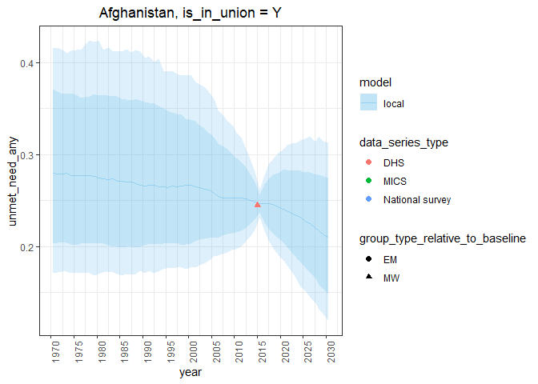
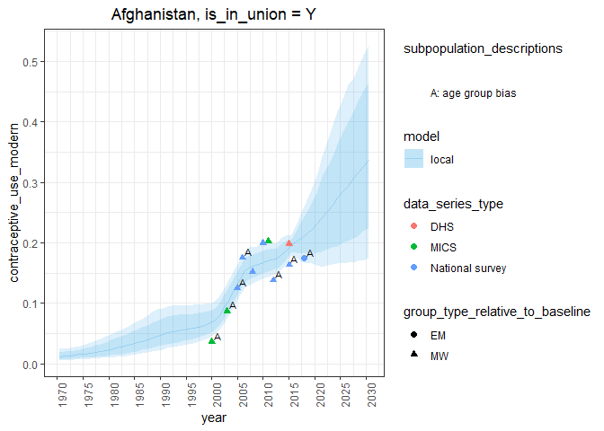
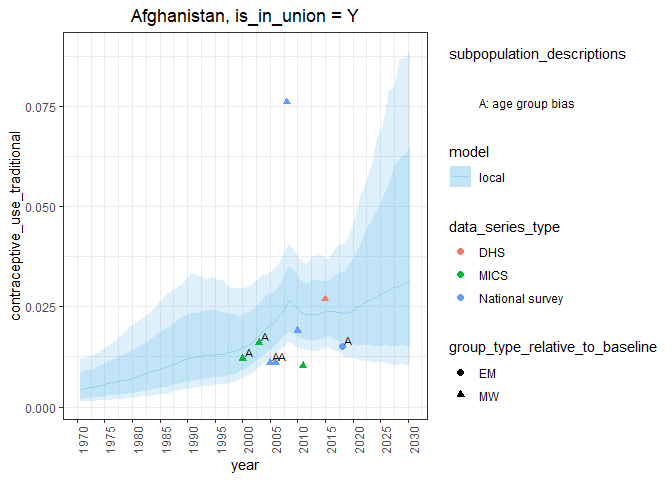
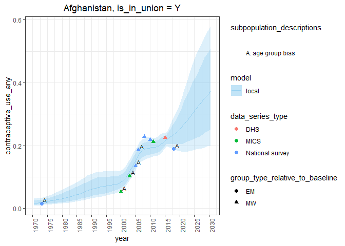

Estimating family planning indicators for married women with custom user
data
================

``` r
library(fpemlocal)
```

## Introduction

In this vignette we obtain estimates for married women with custom user
data.

1.  [Fit a one country model](#fit) `fit_fp_c`
2.  [Calculate point estimates for indicators](#results) `calc_fp_c`
3.  [Plot the point estimates against the survey data](#plot)
    `plot_fp_c`

## <a name="fit"></a>

## 1\. Fit a one country model

Fit the one-country family planning estimation model with the function
`fit_fp_c`. Supply the file path of the .csv file containing your
country survey data to the argument `surveydata_filepath`. Next supply
the UNPD country code known as the `division_numeric_code`. See
`??divisions` for UNPD country codes and other divisions. Specify the
model of your choice with the argument `is_in_union`. There are two
versions of this model, one for in-union women and another for
not-in-union women denoted `"Y"` and `"N"` respectively. Lastly, specify
the years of estimates to be returned. Note: The function will not
filter the survey data based on these years. All years of available
survey data will be used.

``` r
fit <- fit_fp_c(
  surveydata_filepath = "data-raw/manuscript_example_data/afghanistan_4_married_example.csv",
  division_numeric_code = 4,
  is_in_union = "Y",
  first_year = 1970,
  last_year = 2030
)
```

    ## 
    ## -- Column specification --------------------------------------------------------
    ## cols(
    ##   .default = col_double(),
    ##   is_in_union = col_character(),
    ##   age_range = col_character(),
    ##   data_series_type = col_character(),
    ##   group_type_relative_to_baseline = col_character(),
    ##   unmet_need_modern = col_logical(),
    ##   is_pertaining_to_methods_used_since_last_pregnancy = col_character(),
    ##   pertaining_to_methods_used_since_last_pregnancy_reason = col_logical(),
    ##   has_geographical_region_bias = col_character(),
    ##   geographical_region_bias_reason = col_character(),
    ##   has_non_pregnant_and_other_positive_biases = col_character(),
    ##   non_pregnant_and_other_positive_biases_reason = col_logical(),
    ##   age_group_bias = col_character(),
    ##   modern_method_bias = col_character(),
    ##   has_traditional_method_bias = col_character(),
    ##   traditional_method_bias_reason = col_logical(),
    ##   has_absence_of_probing_questions_bias = col_character(),
    ##   record_id = col_character()
    ## )
    ## i Use `spec()` for the full column specifications.

## <a name="results"></a>

## 2\. Calculate point estimates for indicators

Calculate point estimates for family planning indicators with the
function `calc_fp_c`. Supply the fit object from `fit_fp_c` to the
argument `fit`. Read in your population count dataset. Then supply the
dataset to the argument `population_data`.

``` r
population_data <- read.csv("data-raw/manuscript_example_data/afghanistan_4_married_popdata_example.csv")
results <- calc_fp_c(fit = fit,
                     population_data = population_data)
```

A set of results here consist of the following family planning
indicators

``` r
results$Y %>% names
```

    ##  [1] "contraceptive_use_any"                     
    ##  [2] "contraceptive_use_modern"                  
    ##  [3] "contraceptive_use_traditional"             
    ##  [4] "non_use"                                   
    ##  [5] "unmet_need_any"                            
    ##  [6] "unmet_need_modern"                         
    ##  [7] "demand"                                    
    ##  [8] "demand_modern"                             
    ##  [9] "demand_satisfied"                          
    ## [10] "demand_satisfied_modern"                   
    ## [11] "no_need"                                   
    ## [12] "contraceptive_use_any_population_counts"   
    ## [13] "contraceptive_use_modern_population_counts"
    ## [14] "traditional_cpr_population_counts"         
    ## [15] "non_use_population_counts"                 
    ## [16] "unmet_need_population_counts"              
    ## [17] "unmet_need_modern_population_counts"       
    ## [18] "demand_modern_population_counts"           
    ## [19] "demand_population_counts"                  
    ## [20] "demand_satisfied_population_counts"        
    ## [21] "demand_satisfied_modern_population_counts" 
    ## [22] "no_need_population_counts"

The point estimates for each indicator are long-format tibbles. Let’s
take a look at the tibble for the indicator `contraceptive_use_modern`

``` r
results$Y$contraceptive_use_modern
```

    ## # A tibble: 488 x 3
    ##     year percentile  value
    ##    <int> <chr>       <dbl>
    ##  1  1970 mean       0.0122
    ##  2  1971 mean       0.0130
    ##  3  1972 mean       0.0139
    ##  4  1973 mean       0.0149
    ##  5  1974 mean       0.0160
    ##  6  1975 mean       0.0173
    ##  7  1976 mean       0.0187
    ##  8  1977 mean       0.0201
    ##  9  1978 mean       0.0217
    ## 10  1979 mean       0.0234
    ## # ... with 478 more rows

## <a name="plot"></a>

## 3\. Plot estimates and survey data

fpemlocal also includes a function named `plot_fp_c` to plot the
calculated point estimates against the survey data. The arguments to
this function are, the fit object from step 1, the results from step 2,
and a vector of indicator names. The vector of indicator names
corresponds to the names which appear in the results from step 2.

``` r
plot_fp_c(
  fit,
  results,
  indicators = c(
    "unmet_need_any",
    "contraceptive_use_modern",
    "contraceptive_use_traditional",
    "contraceptive_use_any"
    )
  )
```

    ## $Y
    ## $Y$unmet_need_any

<!-- -->

    ## 
    ## $Y$contraceptive_use_modern

<!-- -->

    ## 
    ## $Y$contraceptive_use_traditional

<!-- -->

    ## 
    ## $Y$contraceptive_use_any

<!-- -->
