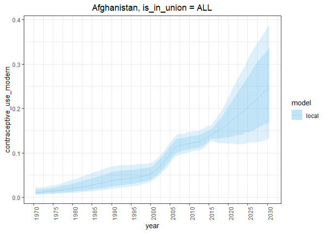

#### 1\. Fit models and obtain samples for all women

Obtaining results for all women entails running the in-union and
not-in-union model. In this case, `fit_fp_c` returns a named list of
fits.

``` r
library(fpemlocal)
fitlist <- fit_fp_c(
  is_in_union = "ALL",
  division_numeric_code = 4,
  first_year = 1970,
  last_year = 2030
)
fitlist %>% names
```

    ## [1] "Y"   "N"   "ALL"

#### 2\. Calculate point estimates for indicators

``` r
resultlist <- calc_fp_c(fitlist)
resultlist %>% names
```

    ## [1] "Y"   "N"   "ALL"

#### 3\. Plot the point estimates and survey data

``` r
plots <- plot_fp_c(
  fitlist,
  resultlist,
  indicators = c(
    "contraceptive_use_modern"
    )
  )
plots %>% names
```

    ## [1] "Y"   "N"   "ALL"

``` r
plots$ALL
```

    ## $contraceptive_use_modern

<!-- -->
