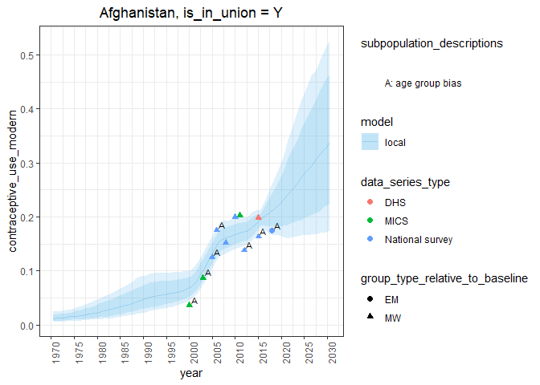

#### 1\. Fit a one country model

``` r
library(fpemlocal)
fit <- fit_fp_c(
  surveydata_filepath = "data-raw/manuscript_example_data/afghanistan_4_married_example.csv",
  division_numeric_code = 4,
  is_in_union = "Y",
  first_year = 1970,
  last_year = 2030
)
```

#### 2\. Calculate point estimates for indicators

``` r
population_data <- read.csv("data-raw/manuscript_example_data/afghanistan_4_married_popdata_example.csv")
results <- calc_fp_c(fit = fit,
                     population_data = population_data)
```

#### 3\. Plot estimates and survey data

``` r
plot_fp_c(
  fit,
  results,
  indicators = c(
    "contraceptive_use_modern"
  )
)
```

    ## $Y
    ## $Y$contraceptive_use_modern

<!-- -->
